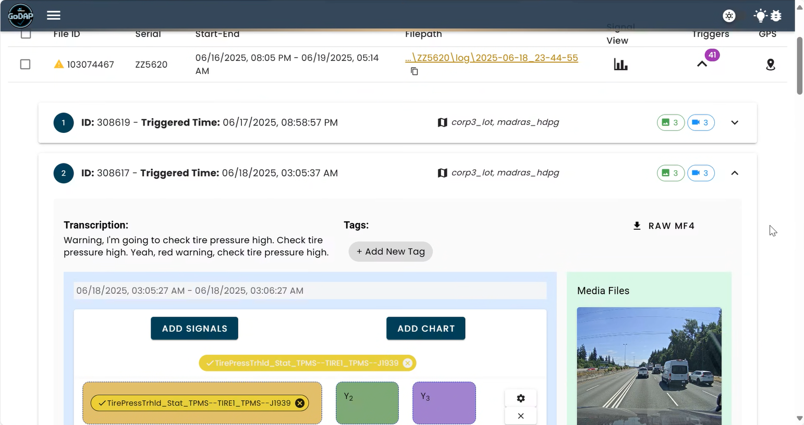

# GoDAP Echo

The localized-LLM, voice transcription, and audio detection tool for the GoDAP web app.
Created by Noah Hickman.



## Features
- Voice Transcription
  - Utilizes Whisper by OpenAI (large-v3 OR medium model) and WhisperX (speaker diarization) libraries for accurate speech transcription
  - Allows for transcription of voice triggers from databucket trigger packages
  - Transcriptions to be tagged and utilized on GoDAP website, to allow easier searching and storing of triggers
- Audio Detection
  - Utilizes Librosa library
  - Turns sound inputs into audio time series, short-time fourier transforms (STFT), and can detect noises within a certain frequency range over a specific volume
  - Allows for detection of different optical acoustic warnings (OAWs), which can be marked as searchable tags on the GoDAP website
  - (Disclaimer: Need audio files from each feature owner/department to make this work)
- Localized classifier model for transcription cleaning
  - Uses a custom trained DistiliBERT classifier model to filter out summaries that aren't relevant information to the trigger
  - Quickly retrainable and adaptable, making it more accurate as you use it
  - Currently has pre-processing of spacy and better-profanity libraries to censor and change names prior to filtering

## Getting Started

All of this code is ran in Python. There is also a postgreSQL backend (`data.trigger`, `data.tags`, and `data.trigger_jobqueue` tables) within the ntm database, data schema.
Please see the "creatingdbtables.txt" file to see the breakdown of each table.

### Table Structure Breakdown
- Overarching reference table: `data.file`
- data.trigger_jobqueue -> column `databucketid` has fkey relationship to `data.file 'id'` (on remove row, cascade delete)
- data.trigger -> column `databucketid` has fkey relationship to `data.trigger_jobqueue 'databucketid'` (on remove row, cascade delete)
- data.tags -> column `triggerid` has fkey relationship to `data.tags 'triggerid'` (on remove row, cascade delete)

### What is a tag?
- Tags are keywords, descriptors, really any thing you want to use to describe the contents of a trigger package and voice trigger.
- In short, the voice transcriptions will be combed through to detect any keywords, and if present, a tag will be added, which will be shown on the table, viewable on the website, and used to clean the transcription.
- The long term goal is allowing users to dynamically add new tags on the website (similar to adding CAN signals), where the table will be updated with a new column, and then the tag can be searched for.
- The tagging script dynamically pulls from the tag column names, so as long as the GoDAP website creates new columns in the tables, the tags can be expanded however the users need.

### How do I reprocess a databucket?
Simply remove the databucketid from data.trigger_jobqueue and a series of cascading deletes will happen, throughout the job queue table, data.trigger, and data.tags. Then, the code will automatically see that the trigger is no missing from the processed list and it will be reprocessed during the next script cycle (occurs every hour). Additionally, a trigger was added to the SQL database structure, so that if a line is removed from data.file, the same cascade delete chain will occur.

### Code Breakdown
- Python 3.12+ (locally tested using 3.12.10, docker images built with 3.12)

**table-populate.py**
- This is the first script in the sequence (found in the triggers folder), which breaks down the incoming trigger packages into its different media components, stores them in the SQL backend, and then transcribes the text.
  - The actual algorithm of this script runs on an hourly basis to check for new databuckets. 
- For main libraries used and dockerfile instructions, please look at the `triggerrequirements_linux.txt`, `trigger_requirements_win.txt` and `triggerdockerfile` files. The requirements are split into both windows and linux-specific, in case you need to test on one os or deploy on another.
- Warning: This script notoriously had long image build and upload times from VSCode to Artifactory. To solve this, I opted for an alternative solution to the heavy library download process:
  - On the 030 network drive, please consult the `\GoDAP_Echo_Model\table_populate_packages` folder to find the necessary .whl files and compressed .tar folders used for the script's libraries
  - These libraries are accessed at the top of the code through the os and subprocess libraries, which download them from the network drive when the code runs
  - Additionally, the Whisper model the script utilizes is on the same network drive (to not need 6+ GBs extra on the image each time you build), in the `\GoDAP_Echo_Model\models\whisper_model\whisper` folder
  - Please ensure these are mounted to your containers as shown in the `docker-compose.yml` file.
 
  Code walkthrough:
    - First, the code uses the subprocess commands to download all the libraries from the network drive
    - Next, it logs into the database connection, it loads the OpenAI whisper model, and starts the trigger while loop
    - At the beginning of the while loop, it extracts all the filetype 4 databuckets from data.file, compares it to the processed ones in trigger_jobqueue, and comes up with a list of databuckets that need to be referenced
    - A for loop is then ran to go through each unprocessed databucket
      - An SQL command places the databucket
      - Inside the for loop, you have a couple small functions, using SQL queries to grab databucket filepaths, trigger_package file paths, and all the files within a trigger package
      - These are then utilized in the actual running code of the loop, to check if the databucket is empty, and if it does have triger packages, extract the trigger files, transcribe the audio file (if there is one) with Whisper, find the truck name, trigger date, and geolocation of the trigger, all utilizing re for filepath parsing, os for checking file directories and filetypes, and the Godap libraries for longitude and latitude, as well as Geolocation
        - All this content is run within a sub for-loop to go through each trigger package of each databucket in the overarching for loop 
        - Towards the end of the sub for loop, you have a series of SQL insert commands to add any new data to the data.trigger table, as well as an empty placeholder row for data.tags, whether the trigger was fully-processed, half-processed, or even if there was an error in the processing
    - The for loop then continues through all unprocessed triggers and then the other for loop for all unprocessed databuckets
    - After for loop completion, the code stops at the while loop for 1 hour, and then continues the entire process again.
    - Theoretically, the code should run indefinitely.

**tag-populate.py**
- This is the second script in the sequence (found in the tag folder), which parses the transcriptions from the SQL backend, and tags the transcriptions for keywords.
  - The actual algorithm of this script runs on an hourly basis to check for newly process trigger packages.  
- For main libraries used and dockerfile instructions, please look at the `tagrequirements.txt` and `tagdockerfile` files.
- Additionally, this script has librosa sound detection capabilities, which can be tuned and used based on the specifications of OAW pitches and frequencies.

  Code walkthrough:
    - First, it logs into the database connection
    - The OAW detection function is then created, to have short-form fourier transform capabilities to break down frequencies and audio noises during audio file analysis. DISCLAIMER: At this moment in time, I do not have the exact frequencies of the OAW noises, which means that the code is here to implement this, but it is not currently implemented...
    - Next, a while loop is used that holds the main functions of the code
      - First, it selects all the column names from the .tags table that are of column type bit, meaning that the name of each bit column are the tags itself. For example, column 'abs' is a bit type column for the tag abs.
      - Next, the code selects a sample row from the data, which will have previous tags filled in, and old tags not filled in, which will show if a tag column has not been checked yet.
      - With this info, as well as checking if new trigger rows have been added (so a row is made with a new tag id, all NULL bit columns), the code decides whether to run
      - If there was a new tag added, the code rechecks all lines. If no new tag, but new rows are added, the new rows will be checked. If no new tags and no new rows, it will wait an hour and try again. 
    - The for loop then continues through all the lines it must check, comparing each tag.lower to the transcription_text.lower, setting to bit type 1 as found and bit type 0 if not found.
    - After for loop completion, the code stops at the while loop for 1 hour, and then continues the entire process again.
    - Theoretically, the code should run indefinitely.

**echo-classifier.py**
- This is the final script in the sequence (found in the classifier folder), which cleans the transcriptions, removing any names, censoring certain words, and utilizes a custom classifier model trained on 300+ transcriptions.
  - The actual algorithm of this script runs on an hourly basis to check for newly tagged triggers ready to be cleaned.
- Warning: This script notoriously had long image build and upload times from VSCode to Artifactory. To solve this, I opted for an alternative solution to the heavy library download process:
  - On the 030 network drive, please consult the `\GoDAP_Echo_Model\classifier_packages` folder to find the necessary .whl files and compressed .tar folders used for the script's libraries
  - These libraries are accessed at the top of the code through the os and subprocess libraries, which download them from the network drive when the code runs
- For main libraries used and dockerfile instructions, please look at the classifierrequirements.txt and classifierdockerfile files. The requirements are split into both windows and linux-specific, in case you need to test on one os or deploy on another.
- Additionally, this script uses the 030 network drive to hold the model necessary to run the code, with the classifier model located in the `\GoDAP_Echo_Model\models\classifier_model\engineering_classifier` folder and the spacy model being located in the `\GoDAP_Echo_Model\models\en_core_web_sm\en_core_web_sm-3.8.0` folder

  Code walkthrough:
    - First, the code uses the subprocess commands to download all the libraries from the network drive
    - Next, it logs into the database connection, it loads the custom classifier model and spacy name model, and starts the trigger while loop
    - Same as table-populate.py, a master_list_triggers and processed_triggers list is made to understand what triggers are unprocessed and need to be gone through
    - A while loop is triggered, which contains the for loop of cleaning the transcriptions
      - First, the functions for redacting names and censoring profanity are created and instantly ran on the transcription text
      - Then, an SQL query is ran to pull all the tags/keywords for the table. If these keywords/tags are in the transcription, it'll be verified in an if loop towards the end of the for loop, the transcription will be placed into the cleaned variable, and will be uploaded to data.trigger as the cleaned_transcription.
      - The function for classifier filtering is also created here, which is run on the transcriptions if no keywords are present in the transcription text. Label 1 means engineering content, which was trained with 200+ good triggers of useful or detailed info, and label 0 means no engineering content, which was trained on 200+ instances of bad triggers, with the radio playing, background noise, excess conversations not relevant to testing, etc.
        - If the label is 0, the cleaned text is just turned into `"No engineering content. Review audio file manually."`
    - After for loop completion, the code stops at the while loop for 1 hour, and then continues the entire process again.
    - Theoretically, the code should run indefinitely.

**classifiertraining.py**
- This is the script utilized to actually train the custon language classification filter. This script can be rerun multiple times to achieve the best possible model by changing input data and tuning the training arguments.
  - Simply change these lines to the model names you want to save it as and run the script... the model will be generated in the same folder as the code.
  ```py
  model.save_pretrained("engineering_classifierV5")
  tokenizer.save_pretrained("engineering_classifierV5")
  ```
  - In addition, this is currently using the DistilBERT model, which I found to be the most useful for this size of dataset. For large datasets, you can consider a model template that may be more suitable, with the best place to find them being on Hugging Face hub.

### How To Use This Repo
- Firstly, download this repo locally.
```git clone https://git.t3.daimlertruck.com/GoDAP/GoDAP_Echo.git```
- Go to the .envtemplate, rename it to .env, and add the missing content (SQL db login info and Docker info)
- If you need to build and push updates to docker, you can utilize the .bat files in order to do that, which will do all the work for you. Make sure you updated your .env prior to this step. Run them directly from file explorer.

